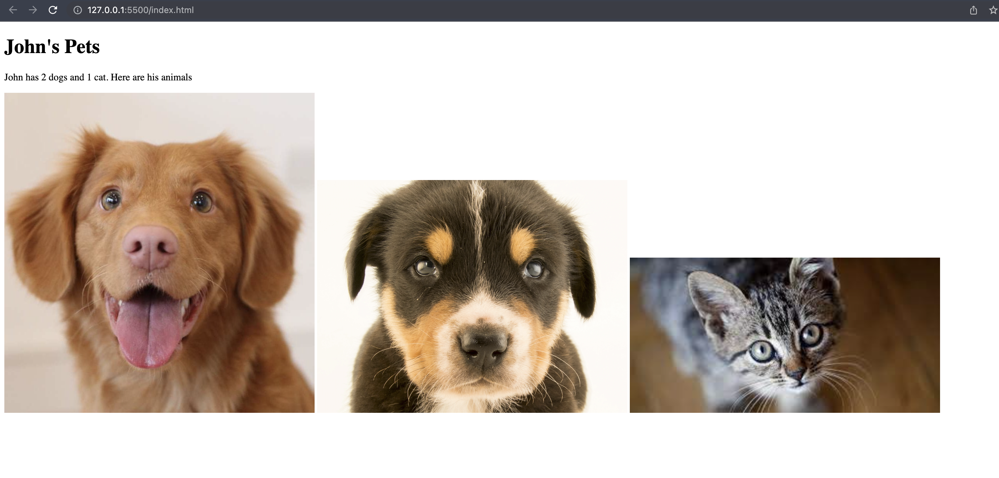

# Intro to HTML/CSS Exercises (Class 3)

**Read before starting**
Create a folder called Code-Labs. In Code-Labs, create a new folder called class-3. You will be working in the class-3 folder for today.

## Exercise 1: John's Pets
- Create a folder inside of class-3 called exercise-1 
- Inside exercise-1, create a file called index.html
- Replicate the following in html, you can use other images from other websites.

## Exercise 2: John's Supermarket for Animals
In the class-3 folder, create a folder called exercise-2. 
John just opened a business for animal products and food. In John's website, he needs to show the following
- A heading with the content `John's Supermarket for Animals`
- A list of products he has in store
  - Dog food $19.99
  - Cat food $15.99
  - Dog shampoo $7.88
  - Dog and Cat Toys $10.99
- An image of both dogs and cats 

## Exercise 3: Styling John's Website 
In John's website, style the following 
- Change the background color 
- Change the heading color 
- Make the images a reasonable width of 500px 
- Add space around the content of the body with margin
